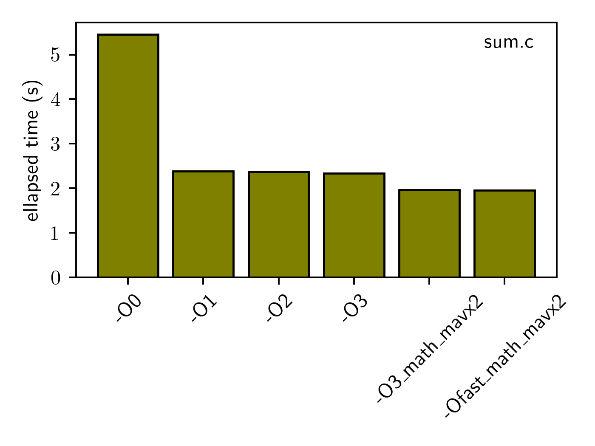
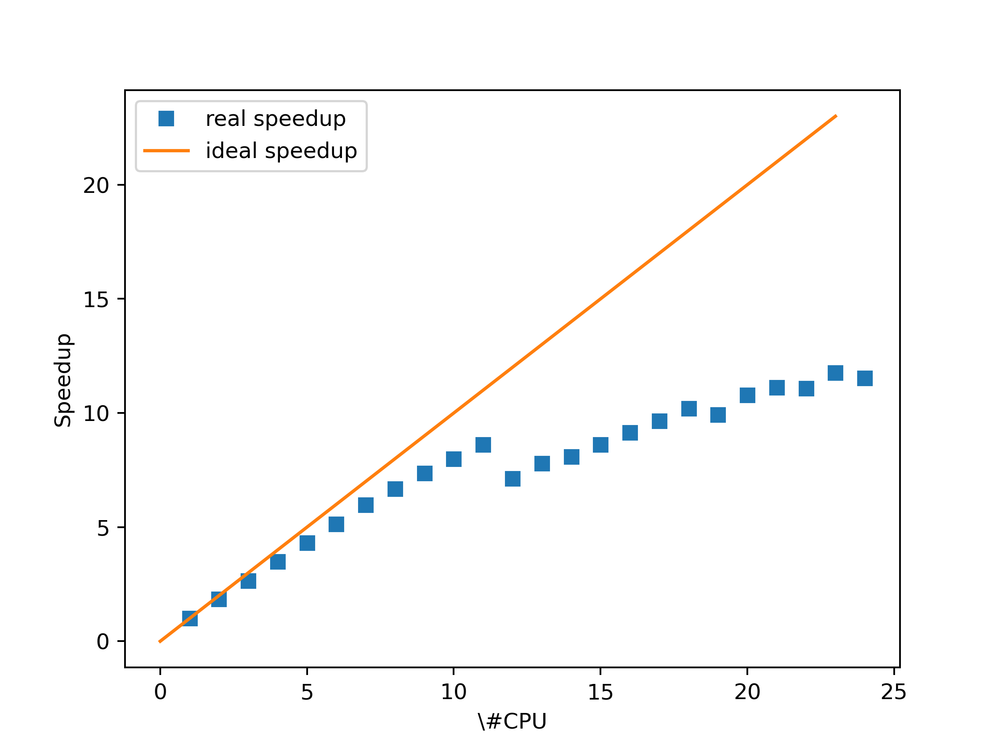

# Exercise session 03

## Exercise 1

**Extract the `getTime()` function and make a separate module out of it, which can be called from your main program.**

We extract 

```C
getTime(void) {
    struct timeval tv;
    struct timezone tz;
    gettimeofday(&tv, &tz);
    return tv.tv_sec + 1e-6*(double)tv.tv_usec;
}
```

from `cpi.c` into the file `gettime.c` and also create a header file `gettime.h` (see both in Exercise 1 subfolder) containing 

```C
double getTime(void);
```
which makes our time measuring function accessible for other C files. 

**Modify the serial version so that it includes your new module.  Add instructions to the makefile to compile the new module and the new serial version.**

We exclude `getTime()` function from `cpi.c` code and input a header `#include "gettime.h"` into it. So our code now looks as follows:

```C
#include <stdio.h>
#include "gettime.h"

static long nSteps = 1000000000;
static double PI25DT = 3.141592653589793238462643;


int main(int argc, char** argv){
    double pi, h, sum, x;
    double tStart, tElapsed;

        h   = 1.0 / (double) nSteps;
        sum = 0.0;
    tStart = getTime();

        for (int i = 0 ; i < nSteps; i ++) {
            x = h * ((double)i - 0.5);
            sum += 4.0 / (1.0 + x*x);
        }
        pi = h * sum;

    tElapsed = getTime() - tStart;
        printf("pi is approximately %.16f, Error is %.16f\n",
                        pi, pi - PI25DT);
    printf("Computed in %.4g seconds\n", tElapsed);
    return 0;
}
```

Note the difference between <> and "" in #include. <> are used to include system headers (located under some system-defined paths), all your custom headers which are located in e.g. your working directory have to be included using "". 

Modifying the `Makefile` yields e.g.

```C
CFLAGS=-O3 -ffast-math -mavx2
CC=cc

all: gettime.o cpi.o cpi cpi_mpi.o cpi_mpi

gettime.o: gettime.c gettime.h

cpi.o: cpi.c gettime.h

cpi: cpi.o gettime.o

cpi_mpi.o: cpi_mpi.c gettime.h

cpi_mpi: cpi_mpi.o gettime.o

clean: 
        rm -f cpi cpi.o gettime.o cpi_mpi.o cpi_mpi
```

**Modify the MPI version `cpi_mpi.c`to call `getTime()` in the beginning of the program (before `MPI_Init()`) and at the end (after `MPI_Finalize()`).  Print the subtracted times to get your execution time.  Adapt the makefile,  compile and run the program.  Two execution times will be outputted.**

The procedure is similar, include the `gettime.h` header and insert the `getTime()` function at the correct spots:

```C
#include <stdio.h>
#include "mpi.h"
#include "gettime.h"

static long nSteps = 1000000000;
static double PI25DT = 3.141592653589793238462643;

int main(int argc, char** argv){
    int n, myRank, nProcs, i;
    double mypi, pi, h, sum, x;
    double tWStart, tWElapsed;

    double tstart_gettime, tend_gettime; //added to measure time using getTime() function

    tstart_gettime = getTime(); // added - start time

    MPI_Init(&argc, &argv);
    MPI_Comm_size(MPI_COMM_WORLD,&nProcs);
    MPI_Comm_rank(MPI_COMM_WORLD,&myRank);

    printf("Process rank: %d\n", myRank);

        h   = 1.0 / (double) nSteps;
        sum = 0.0;

    tWStart = MPI_Wtime();

        for (i = myRank ; i < nSteps; i += nProcs) {
            x = h * ((double)i - 0.5);
            sum += 4.0 / (1.0 + x*x);
        }
        mypi = h * sum;

        MPI_Reduce(&mypi, &pi, 1, MPI_DOUBLE, MPI_SUM, 0,
                   MPI_COMM_WORLD);

    tWElapsed = MPI_Wtime() - tWStart;
        if (myRank == 0){
            printf("pi is approximately %.16f, Error is %.16f\n",
                        pi, pi - PI25DT);
        printf("Computed in %.4g seconds\n", tWElapsed);
    }
    MPI_Finalize();

    tend_gettime = getTime(); //added - end time
    printf("total ellapsed time using getTime: %.4g seconds\n",tend_gettime - tstart_gettime);
    return 0;
}
```

The compilation is already included in the `Makefile` above. Two execution times originate from our `getTime()` function as well as from `MPI_Wtime()` function present in the code. 

**Commit: What are the values of the execution times?  Why are they different?**

The time measured using `MPI_Wtime()` is slightly smaller than the one obtained via `getTime()`. The first measures only the MPI part (integration) of the code, the second includes the setting and closing of MPI. Output can be found in `Exercise1/cpi_mpi_extern_gettime.log`. 

## Exercise 2

**Copy the file `sum.c` to your repository and compile. Time your code by using `getTime()` from Exercise 1.**

Again, include the header file and update the Makefile (files found in `Exercise2/`).

**Compile with different optimisation flags (-O0,-O1,-O2,-O3).**

I created one makefile for all the flags at once and compiled: 

```C
CC=cc

all: sum_O0 sum_O1 sum_O2 sum_O3 sum_O3_math_mavx2 sum_Ofast_math_mavx2 sum_omp

sum_O0: sum.c gettime.h
        ${CC} -O0 -o sum_O0 sum.c gettime.c

sum_O1: sum.c gettime.h
        ${CC} -O1 -o sum_O1 sum.c gettime.c

sum_O2: sum.c gettime.h
        ${CC} -O2 -o sum_O2 sum.c gettime.c

sum_O3: sum.c gettime.h
        ${CC} -O3 -o sum_O3 sum.c gettime.c

sum_O3_math_mavx2: sum.c gettime.h
        ${CC} -O3 -ffast-math -o mavx2 -o sum_O3_math_mavx2 sum.c gettime.c

sum_Ofast_math_mavx2: sum.c gettime.h
        ${CC} -Ofast -ffast-math -mavx2 -o sum_Ofast_math_mavx2 sum.c gettime.c

sum_omp: sum_omp.c gettime.h
        ${CC} -fopenmp -O3 -ffast-math -mavx2 -o sum_omp sum_omp.c gettime.c

clean: 
        rm -f sum_O0 sum_O1 sum_O2 sum_O3 sum_O3_math_mavx2 sum_Ofast_math_mavx sum_omp
```

**Commit: What  results  does  your  code  produce?   Do  you  know  other  ways  to get timings?  How big is the difference in execution time with the different flags?  How did the compiler optimize the code?  How can you make it even faster?**

The resulting timings are plotted in the following bar plot:



Other way of timing for MPI is e.g. already used `MPI_Wtime()`, or there is e.g. `clock()` function within `time.h`  (see https://www.tutorialspoint.com/c_standard_library/c_function_clock.htm)

Explanation of  what `-O` flags do can be found in the lecture notes, we can additionally optimize the code using other flags e.g. `-ffast-math` or increase the speed of vector operations using `-mavx2`.


**Parallelize the code by adding the following line**
```C
#pragma omp parallel for reduction(+ : sum) 
```
**and including the appropriate header.  Hint:  think what part needs to be parallelized. Compile and run the code in parallel.**

The OMP optimization of a simple for loop is very easy (observe the OMP header in the 6-th row):

```C
#include <stdio.h>
#include <stdlib.h>
#include <assert.h>
#include <math.h>
#include "gettime.h"
#include "omp.h"
typedef struct {
    float x;
    float y;
    float z;
    float r2;
} coord;

int main(int argc, char *argv[]) {
    const int N = 1024*1024*256;
    coord *data;
    int i;
    double sum;
    double ts,te; //added to measure time 

    ts = getTime();
    data = malloc(N * sizeof(coord));
    assert(data);


    sum = 0.0;
    #pragma omp parallel for reduction(+ : sum)
    for(i=0; i<N; ++i) {
        data[i].x = i & 31;
        data[i].y = i & 63;
        data[i].z = i & 15;
        data[i].r2 = data[i].x*data[i].x + data[i].y*data[i].y + data[i].z*data[i].z;
        sum += sqrt(data[i].r2);
    }
    te = getTime();
    printf("sum=%f\n", sum);
    printf("total ellapsed time: %.4g seconds",te-ts);
    return 0;
}
```

**Commit :Where  did  you  insert  the  line?   How  did  you  compile?   Provide  the  jobscript.**

The compilation is shown in the above `Makefile`, see the part for `sum_omp`. The jobscript 
```bash
#!/bin/bash -l
#SBATCH --job-name="cpi_omp_extern_gettime"
#SBATCH --account="uzg2"
#SBATCH --time=00:05:00
#SBATCH --nodes=1
#SBATCH --ntasks-per-core=1
#SBATCH --ntasks-per-node=1
##SBATCH --cpus-per-task=12
#SBATCH --partition=debug
#SBATCH --constraint=gpu
#SBATCH --hint=nomultithread


export OMP_NUM_THREADS=$SLURM_CPUS_PER_TASK

srun sum_omp
```
Observe, that I decided not to include directly the `--output`and `--cpus-per-task` options, I can then run the job for various number of CPU's using the command:
```bash
sbatch --cpus-per-task=12 --output=sum_omp_12.out run_sum_omp.job 
```
and only change 12 to whichever number I wish. Of course, there are other options to run the job.

**Run the code with various number of cpus (but don’t overdo it!).**

Jobs can be easily run using the above command.

**Commit :Plot the speedup and discuss.**

One can easily parse the output files using following script:
```bash
#!/bin/bash

for d in sum_omp*.out; do
#if (/ellapsed time: ([0-9]*\.[0-9]+) seconds/) {
c=$(cat $d);
c=${c%seconds*}
c=${c#*time: }

d=${d#*omp\_}
d=${d%\.*}
echo $d $c
done
~    
```

and then run `./parse.sh>speedup.txt` procuding the following .txt file:

```
1 1.979
10 0.2479
11 0.2297
12 0.2775
13 0.254
14 0.2446
15 0.2298
16 0.2164
17 0.2052
18 0.1942
19 0.1995
2 1.067
20 0.1834
21 0.1781
22 0.1788
23 0.1683
24 0.1718
3 0.7447
4 0.5671
5 0.46
6 0.3862
7 0.3316
8 0.2961
9 0.2686
```
After plotting (script in `Exercise2/plot_speedup.py`), we get


We can see almost optimal speedup for small number of CPU and then the expected slow-down. 

## Exercise 3

Superlinear speedup is mostly connected to the fact that with increased number of CPU's increases also the fast memory (cache) capacity. If e.g. your programm needs 4MB of cache and each processor has only 1MB of fast memory, having more CPU's lowers the amount of data that need to be transfered between RAM and cache - lowering the communication overhead.
