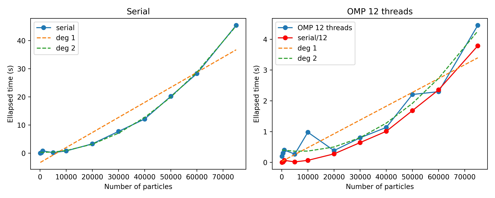

# Exercise Sheet 6: solutions

## 01 - Race conditions

After parallelizing also the second for loop, one can observe the amount of 0's counted differs form run to run and it is not correct (check `./01_race_conditions/race_run/omp_race.logs`). To prevent this, one can use `atomic`, `critical` or `reduction` clauses, you can find the respective codes in `omp_atomic.c`, `omp_critical.c` and `omp_reduction.c` files and the output files in `<clause>_run` folder.

A little tricky is the situation with the first for loop searching for the maximum value inside the file. As the `maxval` is not updated as often as `num_n0` in the second loop, the race conditions there are far more rare, but still there. 

```C
#pragma omp parallel for
    for (int i=0;i<num_size;i++){
        if (numbers[i] > maxval){
            #pragma omp critical //atomic
            maxval = numbers[i];
        }
    }
```

The above implementation of critical and atomic will fail because `maxval` is also present in if statement which is not guarded. Therefore, in case of critical we need to enclose the full `if` statement into critical region as follows:

```C
#pragma omp parallel for
    for (int i=0;i<num_size;i++){
        #pragma omp critical
        {
            if (numbers[i] > maxval){
                maxval = numbers[i];
            }
        }
    }
```

However being correct now, the above implementation basically breaks down the parallelization because everything inside the parallel region is guarded by `critical` clause and therefore accessible only to a single thread at a specific time.

We cannot solve the issue using `atomic` clause as  atomic can handle only very basic operations, but not whole blocks of code. 

Reduction clause works without problems because inside the parallel region, every thread has its own local `maxval` variable which at the end of the region is used to find the global maximum from all the local `maxval`'s. 

```C
#pragma omp parallel for reduction(max: maxval)
for (int i=0;i<num_size;i++) if (numbers[i] > maxval) maxval = numbers[i];
```

## 02 - Poisson solver - OMP version

Which parts of the codes should be parallelized? Most computationally heavy are nested for loops repeated in each iteration:  in `jacobi_step` and `norm_diff` of  `jacobi.cpp`.  OMP parallelization can be simply achieved by adding pragma directives right before the first for loop (one can easily test that is does not make much sense to parallelize both for loops. In norm_diff, one needs to take care to avoid race conditions related to variable `sum`. We also provide the output files from runs with 1,2,4 and 12 threads and for `nx = ny = 161` and `nx = ny = 256`. One can run these test using `./bash_run.sh <number_of_threads> <nx>`. 

Parallelization of `norm_diff`:

```C
double norm_diff(params p, double** mat1, double** mat2){
    double sum = 0.0;
    #pragma omp parallel for reduction (+ : sum)
    for (int i=0; i<p.nx; i++){
        for (int j=0; j<p.ny; j++){
            sum += (mat1[i][j] - mat2[i][j])*(mat1[i][j] - mat2[i][j]);
        }
    }
    sum /= p.nx*p.ny;
    sum = sqrt(sum);
    return sum;
}
```

Parallelization of `jacobi_step`:

```C
void jacobi_step(params p, double** u_new, double** u_old, double** f){
    double dx = 1.0/((double)p.nx - 1);
    double dy = 1.0/((double)p.ny - 1);
	
    #pragma omp parallel for
    for (int i=0; i<p.nx; i++){
        for (int j=0; j<p.ny; j++)
            u_old[i][j] = u_new[i][j];
    }

    #pragma omp parallel for
    for (int i=1; i<p.nx-1; i++){
        for (int j=1; j<p.ny-1; j++)
            u_new[i][j] = 0.25*(u_old[i-1][j] + u_old[i+1][j] + u_old[i][j-1] + u_old[i][j+1] - dx*dy*f[i][j]);
    }
}
```


## 03 - Time complexity

* **Let’s first write an OpenMP version of `nbody.cpp`.  This code is slightly different from what you already encountered as it contains nested for loops.  Here you can decide toadd OpenMP parallel directive to the first, the second, or to both loops.  Which one is the most efficient solution, why?**

First, we add `#include "omp.h"` into `nbody.cpp` (we can again use the original file `nbody.cpp` containing the whole code). To asses which for loop is more efficient to parallelize, we can simply try out three different options: first adding `#pragma omp parallel for` only before the first for loop, then only the second one and at last before both. The first scenario would look as follows:

```scala
 12 void forces(particles &plist) {
 13         int n = plist.size();
 14         #pragma omp parallel for 
 15         for(int i=0; i<n; ++i) { // We want to calculate the force on all particles
 16                 plist[i].ax = plist[i].ay = plist[i].az = 0; // start with zero acceleration
 17                 for(int j=0; j<n; ++j) { // Depends on all other particles
 18                         if (i==j) continue; // Skip self interaction 
 19                         auto dx = plist[j].x - plist[i].x;
 20                         auto dy = plist[j].y - plist[i].y;
 21                         auto dz = plist[j].z - plist[i].z;
 22                         auto r = sqrt(dx*dx + dy*dy + dz*dz);
 23                         auto ir3 = 1 / (r*r*r);
 24                         plist[i].ax += dx * ir3;
 25                         plist[i].ay += dy * ir3;
 26                         plist[i].az += dz * ir3;
 27                 }
 28         }
 29 }
```
We can compile by typing
`CC -ffast-math -fopenmp -o nbody_for1 nbody_for1_args.cpp`
and run via
`sbatch run_nbody_for1_args.job`. 

To measure time, we can use any timing library we like, in this solutions, we compiled the code under perftools-lite which provides the runtime in the log file.

The resulting run times are:
* loop1: 1.13s
* loop2: 25.12 s
* both loops: 1.16s

So we see that parallelizing the first loop is the best option, comparable to parallelizing both, and paralleling the second loop only yields horrible performance. 
The reason why the first and second case is so different can be explained as follows: in the first case, the force calculation is split to respective threads and then each thread calculates the force on its particles independently of other threads. At the end of the calculation, this thread waits until all other threads are done with the calculations. On the other side, parallelizing the second loop, force acting at each particle is calculated in parallel and so the threads need to synchronize once per each particle calculations (N times intsead of once). As expected, the third option would also produce such synchorization overhead, but in a smaller amounts. 

* **The execution time of the code `nbody.cpp` will obviously increase with the number of particles.  What is the expected scaling relation between the code execution time t and the number of particles N?  Can you justify your answer?**

The expected scaling of the serial code is O(N^2), which can be easily observed from the two nested for loops in `forces` routine, which both iterate over all particles.

* **Edit the code nbody.cpp in order to be able to specify the number of particles with a command line argument.  For example `./nbody 1000`should execute the code with 1000 particles.  Does your implementation still work when not specifying any command line argument?  If not, try to include safety nets while reading the command line arguments.**

We expect one positive integer to be passed when running the script. So `argc` which counts the number of agruments used to run the code should have value of 2. First argument stored in `argv` is the name of executable (default) and the second in our case is the number of particles N. So we check the correct number of arguments in line 57 and whether N is >=1 in line 58. If a float number is given, the `atoi` function truncates the decimal part. To measure the ellapsed time, we can use e.g. `chrono` library (`#include <chrono>`). Lines 61 and 68-71 show an example how to measure and print the time. The serial `main` function looks as follows:   

```scala
 48 int main(int argc, char *argv[]) {
 49 
 50         int i;
 51         printf("number of arguments: %d\n",argc);
 52         for(i=0;i<argc;i++)
 53         {
 54             printf("arg %d: %s \n",i+1,argv[i]);
 55         }
 56 
 57         if (argc!=2) printf("wrong number of aguments provided \n");
 58         else if (atoi(argv[1])<1) printf("Provide positive integer\n");
 59         else
 60         {
 61         auto start = std::chrono::high_resolution_clock::now();
 62         int N=atoi(argv[1]); // number of particles
 63         std::cout<<"N="<<N<<"\n";
 64         particles plist; // vector of particles
 65         ic(plist,N); // initialize starting position/velocity 
 66         forces(plist); // calculate the forces
 67 
 68         auto end = std::chrono::high_resolution_clock::now();
 69         auto diff = std::chrono::duration_cast<std::chrono::seconds>(end - start);
 70         auto diff_milli = std::chrono::duration_cast<std::chrono::milliseconds>(end - start);
 71         std::cout<<"Total ellapsed time: "<<diff.count()<<"."<<diff_milli.count()<< "\n";
 72         }
 73         return 0;
 74 }
```

which can be compiled using `CC -ffast-math -O3 -fopenmp -o nbody_serial_args nbody_serial_args.cpp`. 

* **Plot the execution time of the serial code with
N= [100,500,1000,5000,10000,20000,50000]
with  1  node  (using  a  bash  script  is  a  good  idea).   Repeat  the experiment with your OpenMP implementation using 12 threads.  Can you find a good fit to your results?**

To get the results for various N, one can e.g. following bash script:

```scala
  1 #!/bin/bash -l
  2 
  3 # OPTION="serial"
  4 OPTION="for1"
  5 for N in 100 500 1000 5000 10000 20000 30000 40000 50000 60000 75000
  6 do
  7     sbatch --output=scaling_${OPTION}_${N}.out run_nbody_${OPTION}_args.job ${N}
  8     sleep 20
  9 done
```

One can choose "serial" of "for1" option stading for serial code vs. OMP code with first for loop parallelized. The resulting scaling is shown in the following plot:



One can clearly observe the quadratic scaling, we display linear and quadratic fits and in the right panel also the serial runtimes divided by 12 for comparison. We include more data points than requested to demonstrate the scaling more clearly.

* **BONUS: Is it possible to reduce the time complexity of N-body force calculations?**

There are ways how to compute forces between particles in O(n log n) instead of O(N^2). One such approach is Barnes-Hut hierarchical tree algorithm. The idea is in the successive halving of the whole domain: in the beginning, there is one root cell (volume) containing all the particles (thus, the original computational domain). Then the algorithm proceeds recursively starting at the root cell and divide the actual cell into 8 subcells (8 equal subvolumes) if it contains more that one particle. At the end, each cell has 0 or 1 particles in it. The tree of cells is constructed, the root cell being on the top and then 8 "doughter cells" following stemming from a "parent" cell. Each tree node (cell) also contains the information about the total mass included in it and the coordinates of centre-of-mass. 

Suppose we want to calculate a total force acting on the particle p. We iterate over the whole tree (starting with root cell on the top) and check whether the centre-of-mass of this cell is sufficiently far away from particle p. If yes, the net force from all particles in such a cell is approximated by only the force coming from the total included mass at the centre-of-mass position. If the centre-of-mass is not sufficiently far away, we proceed with the daughter cells of such cell. The "sufficiently far away" quantitatively reads: if `l/D< s`, where D is the distance between particle p and centre-of-mass of the cell in consideration, l is the size of cell considered and s is free parameter which needs to be set, usually s~1.  Notice that by setting s=0, we recover the original O(N^2) algorithm. For more information, see the original paper: https://www.nature.com/articles/324446a0.pdf. 
